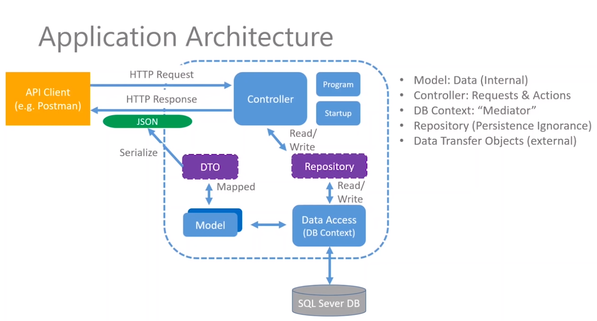
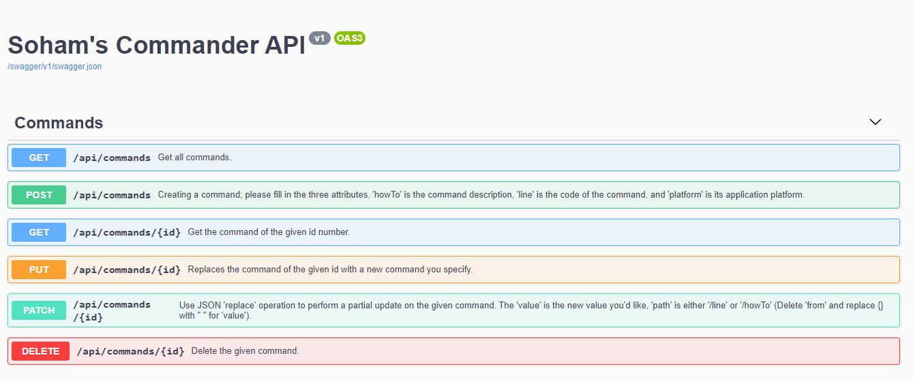
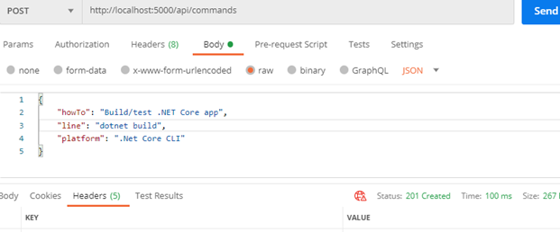
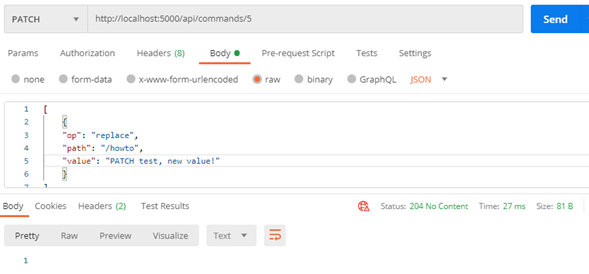

# Commander, a .NET Core MVC REST API
## [REST API](https://www.ibm.com/cloud/learn/rest-apis) for frequently used CLI Commands
### What the API does: 
#### This Commands API is used to review commands that we may use on a daily basis. The snippets for the same are stored along with a short description of what it does and where it's used.
### I made this project for the learning purposes. Concepts learnt:
> - Intro to Backend Development
> - Building a REST API
> - Architecture of MVC
> - C# Fundamentals
> - .NET Core, ASP.NET MVC
> - Microsoft SQL Server
> - Postman, Swagger UI

#### Concepts used:
> - RESTful API guidelines
> - GET, POST, PUT, PATCH, DELETE
> - API Endpoints (SwaggerUI & Postman)
> - HTTP Status Codes
> - SQL Server Express & SSMS
> - Repository design pattern
> - Dependency injection
> - EF Core migrations
> - Data transfer objects (DTOs)

*Note: I've used comments for the purpose of keeping track of what i did and revising later, they are not intended to be code smells :)*

### Application Architecture:

### Swagger UI:

### API Endpoints (CRUD):

## Sample endpoints using Postman:

### [HttpPost] Creates a new command; "201 Created" status code.

### [HttpPatch] Updates the value of the howTo attribute and returns the '204 No Content' status code.

